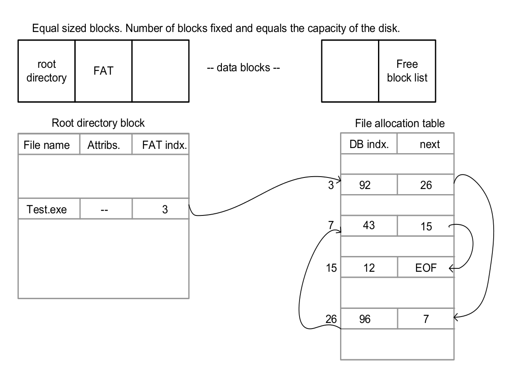
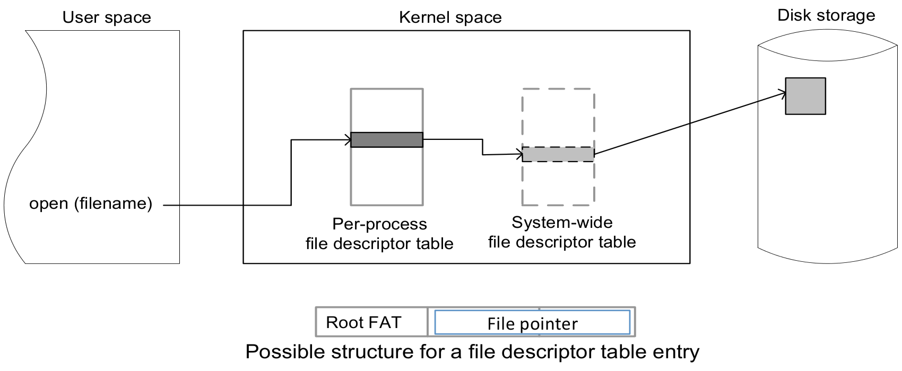

Simple File System
======================	

  
Design and implement a simple file system (SFS). The simple file system handles a single application at any given time, it implements no user concept, does not support protection among files. Although these assumptions are quite dramatic, it leaves the file system still usable in single-tasking environments such as digital cameras and other “embedded” environments. Also, you will implement a simplified interface to the file system with notable restrictions such as: limited length filenames, limited length file extensions, no subdirectories (i.e., only a single “root” directory), few file attributes such as size and no file permissions. A library of C functions will emulate the disk system.

# Objectives

The SFS should implement the following application programming interface (API). The C language based API should look like the following or be a superset of the given API (i.e., should provide more functionality).

	void mksfs(int fresh);					// creates the file system
	void sfs_ls();						// lists files in the root directory
	int sfs_open(char *name);				// opens the given file
	int sfs_close(int fileID);				// closes the given file
	int sfs_write(int fileID, char *buf, int length);	// write buf characters into disk
	int sfs_read(int fileID, char *buf, int length);	// read characters from disk into buf

The file system should be as simple as possible. No need not implement support for hierarchy of directories. All the files will be in a single root directory.

* The **mksfs()** - will format the virtual disk for your own file system, i.e., create necessary disk resident data structures and initialize them. The **mksfs()** has a fresh flag to signal that the file system should be created from scratch. If flag is false, the file system is opened from the disk (i.e., assumes that a valid file system is already there in the filesystem. This persistence is IMPORTANT so that reusing existing data or creating a new file sytem is possible.

* The **sfs_ls()** - will list the contents of the directory in details, i.e., including the information stored in the file control blocks. The **sfs_open()** - opens a file and returns the index on the file descriptor table. If file does not exist, create the new file and set size to 0.

* The **sfs_close()** - closes a file, i.e., removes the entry from the open file descriptor table.

* The **sfs_write()** - writes length bytes of buffered data in buf onto the open file, starting from the current file pointer. This in effect increases the size of the file by “length” bytes.

A file system is somewhat different from other components because it maintains data structures in memory as well as disk! The disk data structures are important to manage the space in disk and allocate and de-allocate the disk space in an intelligent manner. Also, the disk data structures indicate where a file is allocated. This information is necessary to access the file.

# Expected Return Values

The test program expects the following return values for the functions of the SFS API.

	void mksfs(int fresh);

The **mksfs(int fresh)** function does not return any value. It initializes a new file system or reuses an existing file system. You silently ignore any errors that may happen during the initialization of a file system or while opening an existing file system. At least with this simple implementation there is very little chance of a file system getting corrupted. So we ignore that possibility.

	void sfs_ls();

The **sfs_ls()** function does not return any value. It lists the files in the main directory. Again we are ignoring the possibility of root directory corruption.

	int sfs_open(char * name);

The **sfs_open(char * name)** function returns the value of file descriptor associated with the opened file. If the name refers to an existing file, it is opened and a file descriptor value of greater than or equal to 0 is returned. You don’t need to allocate file descriptors 0 (*standard input*), 1 (*standard output*), and 2 (*standard error*). Therefore, your file descriptors can start at 0. You need to return a negative value to indicate error. You will run into an error condition if the root directory is full or the file name is invalid. For example you can impose a 12-character (8.3 characters) limit on the file names. Any input that violates this condition could lead to an error condition. It is important to note that the tester is not checking this particular condition. However, it is generating 8.3 names.

	int sfs_close(int fileID);

The **sfs_close(int fileID)** function returns an integer error code. There is only one interesting condition to check whether the fileID is a valid fileID. If it is previously closed fileID, you need to return an error. You return 0 on success and non-zero on failure.

	int sfs_write(int fileID, char *buf, int length);

The **sfs_write()** function returns the number of bytes actually written to the disk. In most cases, it should be the same as the number of bytes asked to write – length.

	int sfs_read(int fileID, char *buf, int length);

The **sfs_read()** function returns the number of bytes actually read from the disk.
	
  
#Implementation Strategy	
  
The disk emulator given to you provides a constant-cost disk (CCdisk). This CCdisk can be considered as an array of sectors (blocks of fixed size). You can randomly access any given sector for reading or writing. The CCdisk is implemented as a file on the actual file system. Therefore, the data you store in the CCdisk is persistent across program invocations. Let your CCdisk have *N* disk sectors with each sector having a size of *M* bytes. The disk space should be used to allocate disk data structures of the file system as well the files. On disk data structures of the file system include the root directory, free sector list, file allocation table. You can make some simplifying assumptions here and place these data structures in fixed sectors of the disk. For example, sector 0 can be the root directory, sector 1 can be the file allocation table, and sector *N-1* (last sector) can be the free sector list. Within a sector you can use fixed length data structures to store control data.

Files are identified by human readable “file names.” These are strings formed by the user that conform to the file system conventions. You can make up reasonable conventions for the
SFS regarding names. A directory is a table that maps these names to data block locations. The data block locations are defined by the *file allocation table* (FAT). Therefore, the directory entry need not specify all the data block locations. Instead, it just points to the FAT table entry that defines the data block mappings for the file. Each FAT entry specifies the location of a single data block. This means a file needs multiple FAT entries to completely specify its mapping on the disk. To implement this requirement, the FAT entries can be organized in a linked list. It is important to realize that the FAT table is implemented in disk NOT memory. Therefore, ordinary C pointers cannot be used to implement the list in FAT. Instead you should use FAT indexes.

Figure 1 shows an example set of on disk data structures for implementing the SFS. The
figure shows the allocation for an example file Test.exe. In this case, the first FAT entry for **Test.exe** is 3. It points to data block 92, which holds the first portion of **Test.exe**. Suppose a data block is 1000 bytes. Bytes 0 to 999 of **Test.exe** will be found in data block 92. The last data block (data block 12) may not be fully populated with **Test.exe**’s data. This can be determined using the size attribute. The contents of **Test.exe** are held in blocks 92, 96, 43, and 12 (in that order).
Equal sized blocks. Number of blocks fixed and equals the capacity of the disk.

*Figure 1: On-disk data structures of the file system.*

In addition to the on-disk data structures, we need a set of in-memory data structures to implement the file system. The in-memory data structures improve the performance of the file system by caching the on disk information in memory. Two data structures should be used in this assignment: directory table and file descriptor table(s). The directory table keeps a copy of the directory block in memory. When you want to create, delete, read, or write a file, first operation is to find the appropriate directory entry. Therefore, directory table is a highly accessed data structure and is a good candidate to keep in memory. Another data structure to cache in the memory is the free block list. See the class notes for different implementation strategies for the free block list.

Figure 2 shows an example set of in-memory data structures. The open file descriptor table(s) can be implemented in two different ways. You can have a process specific one and a system-wide one. This is more general and closely follows the UNIX implementation. You can simplify the situation and have only the table – this is reasonable because we assume that only process is accessing a file at any given time (i.e., no simultaneous access to a single file by multiple processes).

As shown in Figure 2, the entry in the file descriptor table can be used to provide some
information regarding the reading and writing locations. The mandatory information is the FAT root for the file. For example in the previous example the FAT root is 3 for **Test.exe**. When a file is written to, the write pointer moves by the amount of bytes that is written onto the file. In SFS, the write and read pointers are the same. When a file is opened, the pointers are set to byte zero. The only way to append to a file is to read it until the end of file and then write the new data – not the most efficient way of appending! The SFS is not required to provide a **seek()** command to explicitly control the position of the file pointer. Please note you are required to write data in arbitrary length chunks onto the file. In addition to these data structures, we can
have caching structures for FAT and directory blocks.

*Figure 2: In-memory data structures for the file system.*

Following are some of the main operations supported by the filesystem: creating a file,
growing a file, shrinking a file, removing a file, and directory modifications.

To create file:
* 1. Allocate and initialize an FAT node.
* 2. Write the mapping between the FAT node and file name in the root directory.
* 3. Write this information to disk.
* 4. No disk data block allocated. File size is set to 0.
* 5. This can also “open” the file for transactions (read and write). Note that the SFS API does not have a separate create() call. So you can do this activity as part of the open() call.

To grow a file:
* 1. Allocate disk blocks (mark them as allocated in your free block list).
* 2. Modify the file's FAT node to point to these blocks.
* 3. Write the data the user gives to these blocks.
* 4. Flush all modifications to disk.
* 5. Note that all writes to disk are at block sizes. If you are writing few bytes into a file, this might actually end up writing a block to next. So if you are writing to an existing file, it is important you read the last block and set the write pointer to the end of file. The bytes you want to write goes to the end of the previous bytes that are already part of the file. After you have written the bytes, you flush the block to the disk.

